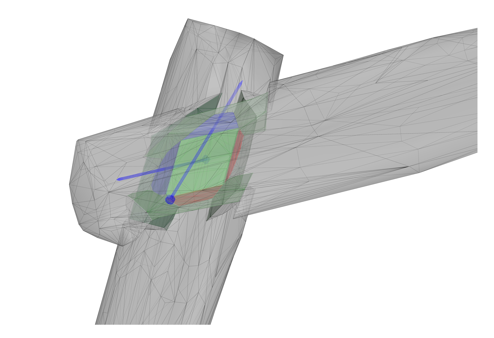

# rw-joint-calculator
This repo contains (highly) experimental code to calculate the forces in a roundwood joint such as this one:

*fig. 1: Roundwood joint base on the one developed by [@petrasvestartas](https://github.com/petrasvestartas)*

> [!WARNING]
> The current implementation does not take the screw into account (or rather assumes a central screw that takes all the tensile stresses perfectly in it axis). When that is fixed this warning will be removed :)

> [!WARNING]
> The current implementation only calculates the stresse resulting from moments, not axial stresses.

> [!WARNING]
> This repo has NOT been validated by mechanical tests, and the results might be very wrong, so do not use this for any other purpose than experimental research

## class diagram
This is just a small class diagram to explain easily the logic followed

