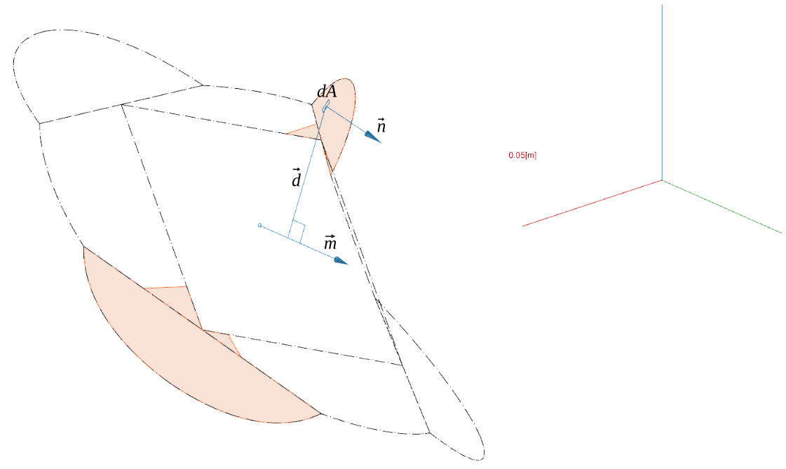

# analytical analysis of roundwood joint

Under rotation around the m vector, the stresses $\sigma$ on a $dA$ element surface participate to the moment around $\vec{m}$ by:
$$M = \sum_i \int_{\Omega_i} \sigma * dA * (\vec{d} \times \vec{n}) \cdot \frac{\vec{m}}{||\vec{m}||} $$

Where:
- $\vec{n}$ is the unit normal vector to the area element $dA$.
- $\Omega_i$ is the joint face that can actively participate the the moment by contact forces only (no glue, so no tension is allowed on the joint faces). Tension forces are only taken by a screw passing by $\vec{m}$, and will be computed later.

Also, by a rotation of $\psi$ around the m axis, the stresses on a joint face can be expressed as:

$$ \sigma = \frac{\tan(\psi) || \vec{d}\times\vec{n} ||}{L} * E $$

Where L is the effective depth of wood considered compressed by the stresses on the face.

Due to the angle of the joint faces with respect to the wood fibres, the Young modulus will not be identical for all faces. If we inject the equation above in the first equation:
$$M = \sum_i \int_{\Omega_i} \tan(\psi) || \vec{d}\times\vec{n} || * dA * (\vec{d} \times \vec{n}) \cdot \frac{\vec{m}}{||\vec{m}||} * \frac{E_i}{L_i}$$

Assuming the Young modulus and the effective depth are constant over the surface:
$$M = \tan(\psi) \sum_i \frac{E_i}{L_i} \int_{\Omega_i} || \vec{d}\times\vec{n} || * dA * (\vec{d} \times \vec{n}) \cdot \frac{\vec{m}}{||\vec{m}||}$$

If we separate $\vec{d}$ into a perpendicular and parallel component to $\vec{n}$: $\vec{d} = \vec{d_{\perp}} + \vec{d_{\parallel}}$

$$M = \tan(\psi) \sum_i \frac{E_i}{L_i} \int_{\Omega_i} || (\vec{d_{\perp}} + \vec{d_{\parallel}}) \times \vec{n} || * dA *  ((\vec{d_{\perp}} + \vec{d_{\parallel}}) \times \vec{n} ) \cdot \frac{\vec{m}}{||\vec{m}||}$$

$$M = \tan(\psi) \sum_i \frac{E_i}{L_i} \int_{\Omega_i} || \vec{d_{\perp}}\times \vec{n} || * dA * (\vec{d_{\perp}}\times \vec{n} )\cdot \frac{\vec{m}}{||\vec{m}||}$$

$$M = \tan(\psi) \sum_i \frac{E_i}{L_i} \int_{\Omega_i} || \vec{d_{\perp}} || * ||\vec{d_{\perp}}|| * \cos(\widehat{(\vec{d}\times \vec{n}), \vec{m}}) * dA $$

Lastly, assuming the rotation is sufficiently small for $\psi \approx \tan(\psi)$ (with $\psi$ in radiants).
We also call $\theta$ the angle between $(\vec{d_{\perp}}\times \vec{n})$ and $\vec{m}$
$$M = \psi \sum_i \frac{E_i}{L_i} \int_{\Omega_i} || \vec{d_{\perp}} || ^2 * \cos(\theta) * dA $$

This expression depends on $L_i$, the effective depths taken into account for the deformation of the joint faces. It is not a value we can determine a-priori, and it determines linearly the value of $\psi$ for a given moment. A first-order estimate is to assume $L_i$ is proportional to the log radius $r$, leading to $L_i=r$. This choice is heuristic and must be validated experimentally.
The expression also depends on $\theta$, which is not constant on $\Omega_i$. One option is to use the value at the face centroid and thus be able to extract the $\cos(\theta)$ from the integral, assuming $\theta$ is sufficiently homogeneous over the face. This assumption is very dependent on joint geometry and should be systematically validated for a given geometry. Another is to discretize the surface and evaluate the integral as a Riemann sum.
